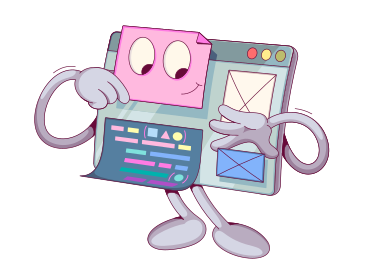
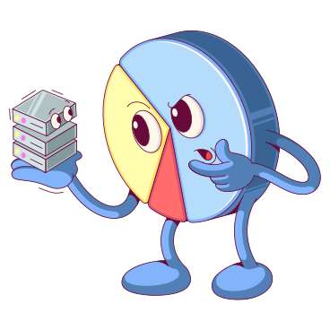

<!-- markdownlint-disable MD041 -->

<picture>
    <source
        srcset="https://readme-typing-svg.herokuapp.com?font=Fira+Code&pause=1000&color=F7F7F7&center=true&vCenter=true&random=false&width=435&lines=Aspire+to+Create"
        media="(prefers-color-scheme: dark)"
    />
    
</picture>

___

## About me

Hello my name is Zachary and I hope to create inspiring projects. I hope to create cool and fun projects that meet language and format standards, and that inspire others to create and learn.

> "Many of life's failures are people who did not realize how close they were to success when they gave up."  
> ― Thomas Edison
___

## Notable projects

I don't have many projects to show off, yet, but I have a few work in progress projects that I'm excited for.

1. **[Null](https://github.com/Tired-Fox/lang-null)**
    * Doesn't exist? Nope! This is a programming language that I started making from scratch to learn the low level process of how programming languages work.
2. **[Story Tree](https://github.com/StoryTreeGames)**
    * This is fairly early, but I have always enjoyed created games. So in spite of everyone saying it is insane, I decided to start creating a collection of libraries to create my own game engine.
3. **\*To Be Named\* (Game Game Website)**
    * To continue on with my love for videogames and their development, I started prototyping a website that contains a hub for game jams. The jams themselves are not hosted on this site. Instead it handles events and collecting general information into a single location.
4. **[My Blog](https://tired-fox.vercel.app/blog)**
    * I haven't been a person that is always on social media, let alone someone who uses it. A goal of mine is to change this in a positive and productive way. I plan to "blog" about my thoughts and findings while creating my projects. This does two things: serve as a reference to look back on in the future, and a detailed process on how I create to inspire others.

> Follow my progress and see my process on [my website](https://tired-fox.vercel.app/blog)

___

## Languages and Tools

___
<footer>
    
<picture>
<source
srcset="https://github-readme-stats.vercel.app/api?username=tired-fox&show_icons=true&theme=dracula&hide_border=true&hide_title=true&hide=commits"
media="(prefers-color-scheme: dark)"
/>
<source
srcset="https://github-readme-stats.vercel.app/api?username=tired-fox&show_icons=true&hide_border=true&hide_title=true&hide=commits"
media="(prefers-color-scheme: light), (prefers-color-scheme: no-preference)"
/>

</picture>

<h2>Links</h2>

    Illustrations from <a href="https://icons8.com/illustrations" target="_blank">Ouch!</a> from the  style <a href="https://icons8.com/illustrations/style--handy-line">handy line</a>.

    Learn more about what I do at
    <a href="https://tired-fox.vercel.app/">my website</a>.

</footer>
